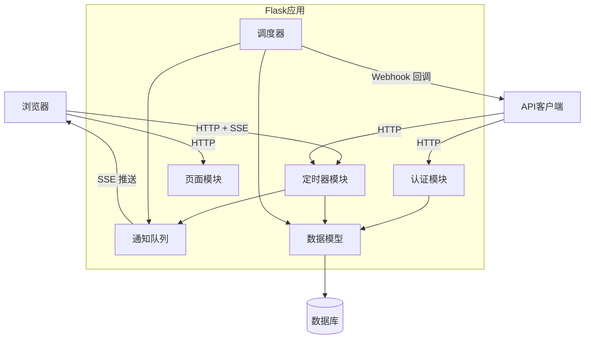
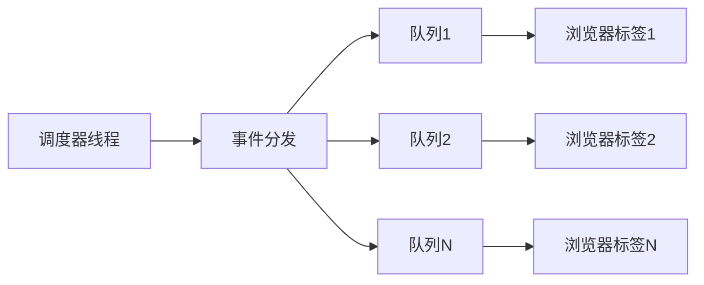
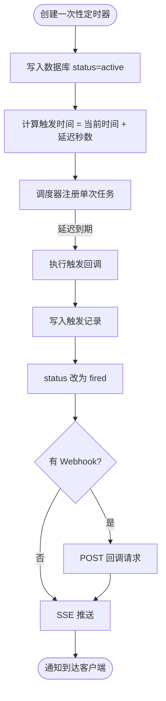
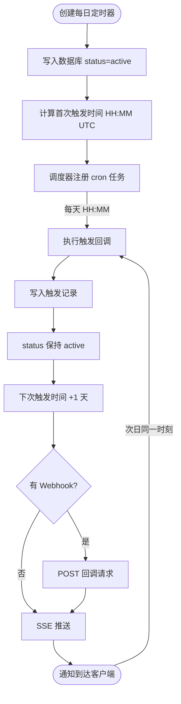

# TimerService — 系统设计文档

## 1. 系统架构总览



---

## 2. 组件详解

### 2.1 Flask 应用工厂 (`app/__init__.py`)

使用工厂模式 `create_app(config_name)` 创建应用实例，支持不同环境配置（default / testing）。

初始化顺序：
1. 加载配置
2. 初始化 SQLAlchemy、JWT
3. 注册三个 Blueprint
4. 创建数据库表
5. 若 `SCHEDULER_ENABLED=True`，启动 APScheduler 并从 DB 恢复激活定时器

### 2.2 数据模型

#### User
| 字段 | 类型 | 说明 |
|------|------|------|
| id | Integer | 主键 |
| username | String(80) | 唯一 |
| password_hash | String(256) | Werkzeug 哈希 |
| created_at | DateTime | 注册时间 |

#### Timer
| 字段 | 类型 | 说明 |
|------|------|------|
| id | Integer | 主键 |
| user_id | Integer | 外键 → User |
| name | String(200) | 定时器名称 |
| timer_type | String(20) | `one_time` / `daily` |
| delay_seconds | Integer | 一次性定时器延迟（秒） |
| trigger_time | String(5) | 每日触发时间 `HH:MM` UTC |
| webhook_url | String(500) | 可选回调 URL |
| status | String(20) | `active` / `fired` / `cancelled` |
| apscheduler_job_id | String(100) | 调度器 Job ID，用于取消 |
| next_fire_at | DateTime | 下次触发时间 |
| last_fired_at | DateTime | 上次触发时间 |

#### TimerEvent（触发审计日志）
| 字段 | 类型 | 说明 |
|------|------|------|
| id | Integer | 主键 |
| timer_id | Integer | 外键 → Timer |
| fired_at | DateTime | 触发时间 |
| webhook_status | String(20) | `success` / `failed` / `skipped` |
| webhook_response_code | Integer | Webhook HTTP 响应码 |

### 2.3 调度器服务 (`scheduler_service.py`)

- 使用 `APScheduler.BackgroundScheduler`，在独立线程中运行
- **一次性定时器**：`trigger='date'`，`run_date=next_fire_at`
- **每日定时器**：`trigger='cron'`，`hour=HH, minute=MM`
- `fire_timer(timer_id)` 在 APScheduler 线程中运行，需手动管理 Flask app context
- 服务重启时调用 `restore_timers()` 从 DB 加载所有 `status=active` 的定时器重新调度

**线程安全关键点：**
```python
def fire_timer(timer_id):
    with _app.app_context():          # 手动推入 app context
        timer = Timer.query.get(...)  # Flask-SQLAlchemy 的 scoped_session 处理线程隔离
        ...
        db.session.commit()
        push_event(timer.user_id, ...)
```

### 2.4 SSE 通知模块 (`notifications.py`)



- 每个 SSE 客户端连接时调用 `register_client(user_id)` 创建私有 `Queue`
- APScheduler 回调通过 `push_event` 将事件放入该用户的所有 Queue
- SSE 生成器 `event_stream()` 以 15 秒超时从 Queue 取事件；超时则发送心跳注释
- 连接关闭时（`GeneratorExit`）调用 `unregister_client()` 清理 Queue，防止内存泄漏
- `threading.Lock` 保护 `_clients` 字典的并发读写

### 2.5 认证策略

登录返回两种 token：

| Token | 有效期 | 用途 |
|-------|--------|------|
| access_token | 24 小时 | 所有 API 请求的身份凭证 |
| refresh_token | 30 天 | 仅用于换取新的 access_token |

- **API 接口**：`Authorization: Bearer <access_token>` 请求头
- **Token 刷新**：`POST /api/auth/refresh`，Header 携带 refresh_token，返回新的 access_token
- **SSE 端点**：access_token 作为 URL 查询参数 `?token=<JWT>`（浏览器 `EventSource` API 不支持自定义请求头）
- **Web 控制台**：access_token 和 refresh_token 均存入 Flask Session；收到 401 时前端自动调刷新接口，用户无感知

---

## 3. 定时器生命周期

### 一次性定时器



### 每日定时器



---

## 4. 安全设计

| 威胁 | 防护措施 |
|------|----------|
| 未授权访问 API | 所有 /api/timers 端点需要有效 JWT |
| 跨用户访问定时器 | 所有查询均加 `user_id=current_user` 过滤；不存在或不属于当前用户均返回 404（防枚举） |
| 密码明文存储 | 使用 Werkzeug `generate_password_hash`（PBKDF2-SHA256） |
| JWT 伪造 | 签名验证由 flask-jwt-extended 处理 |
| SSRF（Webhook URL） | 仅允许 http:// / https:// 前缀；5 秒超时防止阻塞 |
| 生产环境密钥 | `SECRET_KEY` / `JWT_SECRET_KEY` 必须通过环境变量覆盖 |

---

## 5. 配置说明

| 配置项 | 默认值 | 说明 |
|--------|--------|------|
| `SECRET_KEY` | dev-secret | Flask Session 加密密钥，**生产必须修改** |
| `JWT_SECRET_KEY` | jwt-dev-secret | JWT 签名密钥，**生产必须修改** |
| `SQLALCHEMY_DATABASE_URI` | sqlite:///timer_service.db | 数据库连接串 |
| `JWT_ACCESS_TOKEN_EXPIRES` | 24h | access_token 有效期 |
| `JWT_REFRESH_TOKEN_EXPIRES` | 30天 | refresh_token 有效期 |
| `SCHEDULER_ENABLED` | True | 测试时设 False 禁用调度器 |

---

## 6. 部署建议

```bash
# 1. 安装依赖
pip install -r requirements.txt
pip install gunicorn

# 2. 设置环境变量
export SECRET_KEY="your-random-secret"
export JWT_SECRET_KEY="another-random-secret"

# 3. 启动（--threads 支持并发 SSE 连接）
gunicorn "app:create_app()" --bind 0.0.0.0:5000 --threads 4 --worker-class gthread
```

**注意**：生产环境建议使用 PostgreSQL 替代 SQLite，并部署在 HTTPS 之后（防止 JWT 查询参数被记录到 Nginx 日志）。

---

## 7. 技术选型

| 组件      | 选型                    |
| ------- | --------------------- |
| Web 框架  | Flask 3.x             |
| 调度器     | APScheduler 3.x       |
| 数据库 ORM | Flask-SQLAlchemy      |
| 认证      | flask-jwt-extended    |
| 实时通知    | SSE（优先）+ Webhook      |
| 测试      | pytest + pytest-flask |
